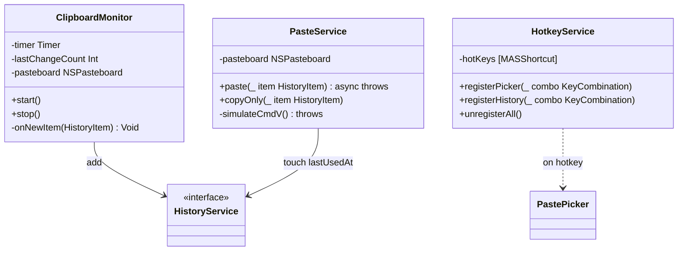
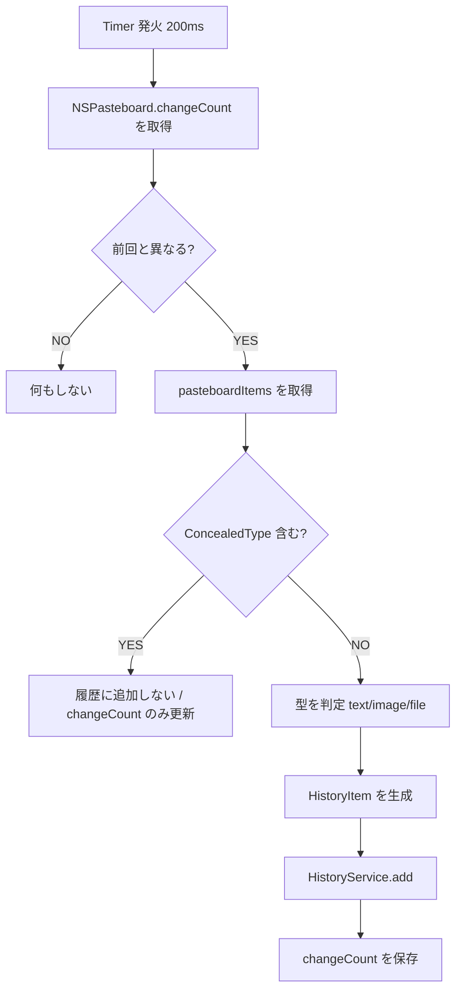
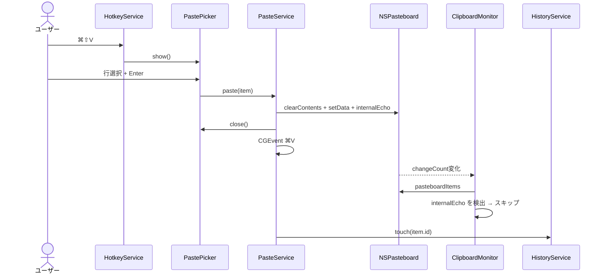

# clip-shelf - クリップボード監視・自動ペースト仕様（バックエンド）

> **機能**: [clip-shelf](./index.md)
> **ステータス**: 下書き

## 概要

システムクリップボードの変更を検知して履歴に追加する `ClipboardMonitor`、グローバルショートカット登録の `HotkeyService`、選択履歴の自動ペーストを担う `PasteService` の3サービス仕様。

## モジュール構成



## ClipboardMonitor

### 役割

`NSPasteboard.general` の `changeCount` を一定間隔でポーリングし、変化があれば新しい履歴項目を作成して `HistoryService.add()` に渡す。

### 公開インターフェース

```swift
final class ClipboardMonitor {
    init(historyService: HistoryService, settings: SettingsStore)
    func start()    // タイマー開始
    func stop()     // タイマー停止
}
```

### 監視方式

| 項目 | 仕様 |
|:-----|:-----|
| 方式 | `Timer.scheduledTimer` による `changeCount` ポーリング |
| 間隔 | 200ms |
| スレッド | メインスレッド（`NSPasteboard` はメインスレッド要件） |
| 取得 | `changeCount` の変化時のみ `pasteboardItems` を読む |

NSPasteboard は通知 API がないため、業界標準のポーリング方式を採用。200ms は「コピーから履歴反映までの体感遅延（FR-001 の 200ms 以内）」とアイドル時 CPU 1% 未満の両立点。

### 処理フロー



### 型判定ルール

| 入力 PasteboardType | 判定 | HistoryItem.kind |
|:-------------------|:-----|:----------------|
| `public.utf8-plain-text` のみ | プレーンテキスト | `.text` |
| `public.utf8-plain-text` + `public.rtf` | リッチテキスト | `.text`（`rtfData` を保持） |
| `public.png` / `public.tiff` / `public.jpeg` | 画像 | `.image` |
| `public.file-url` | ファイル参照 | `.file` |
| 上記の複合 | 優先順位: 画像 > ファイル > テキスト | 主要型に基づく |
| その他のみ | 履歴化しない（無視） | - |

### 除外ルール

| 条件 | 動作 |
|:-----|:-----|
| `org.nspasteboard.ConcealedType` を含む | 履歴化しない |
| `org.nspasteboard.TransientType` を含む | 履歴化しない（一時的なコピーのため） |
| 設定 `respectConcealedType = false` | `ConcealedType` を無視して履歴化 |
| 設定 `includeImages = false` で型が `.image` | 履歴化しない |
| 自アプリ（clip-shelf）が書き戻したもの | 履歴化しない（後述の自己コピー検出） |

### 自己コピー検出

`PasteService` が書き戻す際、`NSPasteboard` に独自タイプ `app.clip-shelf.internalEcho`（UUID 文字列）を併せて書き込む。`ClipboardMonitor` はこのタイプを検出したら履歴化をスキップし、`changeCount` のみ更新する。

これにより「ピッカーから貼り付けた直後に同じ内容が履歴の先頭に重複追加される」問題を防ぐ。

### サイズ制限

| 型 | 上限 | 上限超過時 |
|:---|:-----|:----------|
| `.text` | 5 MB | 履歴化するが、検索インデックスは先頭1MBのみ |
| `.image` | 50 MB | 履歴化しない（警告ログのみ） |
| `.file` | パス文字列のみ保存（サイズ無制限） | - |

### エラーハンドリング

| エラーケース | 動作 |
|:------------|:-----|
| `pasteboardItems` が nil | スキップ。次のタイマー発火を待つ |
| `HistoryService.add` 失敗 | エラーログ。次の `changeCount` 変化時に再試行 |
| 起動時の `changeCount` 取得失敗 | 監視を1秒後に再開（リトライ最大3回） |

### ライフサイクル

| イベント | 動作 |
|:--------|:-----|
| アプリ起動 | `start()` を呼び、初期 `changeCount` を保存 |
| 設定変更 | `respectConcealedType` / `includeImages` は次回ポーリングで即座に反映 |
| アプリ終了 | `stop()` で Timer 解放 |

## HotkeyService

### 役割

`MASShortcut` を使い、グローバルなキーボードショートカットを OS に登録する。ピッカー用と履歴ブラウザ用の2つを管理。

### 公開インターフェース

```swift
final class HotkeyService {
    init(settings: SettingsStore)
    func registerAll()  // settings から読み出して登録
    func unregisterAll()

    var onPickerHotkey: (() -> Void)?
    var onHistoryHotkey: (() -> Void)?
}
```

### 登録するショートカット

| 用途 | デフォルト | 設定キー |
|:-----|:----------|:--------|
| ピッカーを開く | `Cmd + Shift + V` | `shortcut.picker` |
| 履歴ブラウザを開く | `Cmd + Shift + H` | `shortcut.history` |

### 衝突検知

| 検知タイミング | 動作 |
|:-------------|:-----|
| 起動時に登録失敗 | アプリ起動完了後にトースト「`⌘⇧V` を登録できませんでした」 + 設定リンク |
| 設定画面で記録中に既知の OS 予約と一致 | 確定ボタンを無効化し、警告メッセージ表示 |

### 既知の予約ショートカット（参考）

| キー | 予約元 |
|:-----|:-------|
| `Cmd + Space` | Spotlight |
| `Cmd + Tab` | アプリ切替 |
| `Cmd + Shift + 3/4/5` | スクリーンショット |

これらと衝突する組み合わせは設定で警告を出す。

## PasteService

### 役割

選択された履歴項目をアクティブアプリにペーストする。クリップボードへ書き戻したうえで `Cmd + V` キーストロークをシミュレートする「書き戻し方式」を採用。

### 公開インターフェース

```swift
final class PasteService {
    init(pasteboard: NSPasteboard = .general, historyService: HistoryService)
    func paste(_ item: HistoryItem) async throws
    func copyOnly(_ item: HistoryItem)
}
```

### 処理フロー（paste）

```mermaid
flowchart TD
    A[paste(item) 呼び出し] --> B[NSPasteboard.clearContents]
    B --> C[item.kind に応じて型を書き戻し]
    C --> D[内部エコータイプ app.clip-shelf.internalEcho を併せて書く]
    D --> E[活性ピッカー/ウィンドウを閉じる]
    E --> F[一瞬待つ 30ms]
    F --> G[CGEventでCmd+Vを送信]
    G --> H[HistoryService.touch(item)]
    H --> Z[完了]

    G --> X{Accessibility権限}
    X -->|不足| Y[PasteError.accessibilityDenied を throw]
```

### 型別の書き戻し

| `HistoryItem.kind` | 書き戻し内容 |
|:------------------|:------------|
| `.text` | プレーン: `setString(_:forType: .string)` / RTF があれば `setData(_:forType: .rtf)` も併記 |
| `.image` | 元データを `setData(_:forType:)` で書く（PNG/JPEG/TIFF） |
| `.file` | NSURL を `writeObjects([url])` で書く |

### Cmd+V シミュレート

`CGEvent` で `Cmd + V` を down/up で送信する。送信先は OS のフロントモストアプリ。

```swift
let src = CGEventSource(stateID: .combinedSessionState)
let vDown = CGEvent(keyboardEventSource: src, virtualKey: 0x09, keyDown: true)
let vUp   = CGEvent(keyboardEventSource: src, virtualKey: 0x09, keyDown: false)
vDown?.flags = .maskCommand
vUp?.flags = .maskCommand
vDown?.post(tap: .cghidEventTap)
vUp?.post(tap: .cghidEventTap)
```

### 権限要件

`CGEvent.post(tap: .cghidEventTap)` には **Accessibility（アクセシビリティ）権限**が必要。初回起動時にユーザーへ説明し、設定アプリの「セキュリティとプライバシー > アクセシビリティ」へ誘導する。

### エラーハンドリング

| エラー | 発生条件 | 振る舞い |
|:-----|:---------|:--------|
| `PasteError.accessibilityDenied` | `AXIsProcessTrusted()` が false | ペーストせず、UI 側でバナー表示 |
| `PasteError.pasteboardWriteFailed` | `setData` 失敗 | ペーストせず、行に赤いインジケータ |
| `PasteError.itemNotFound` | 項目が削除済 | UI 側でリストを更新 |

### 非機能要件

| 項目 | 目標値 |
|:-----|:-------|
| ピッカー閉じてからフォーカス先アプリでペーストされるまで | 100ms 以下 |
| 同時実行 | 直列処理（並列で `paste` を呼んでも順次実行） |

## サービス間連携



## 制限事項

- `CGEvent` の `Cmd+V` シミュレートは Accessibility 権限が必要で、付与されていない場合は機能しない
- ポーリング方式のため理論上は 200ms 以内に発生した複数コピーは取りこぼし得る（実用上はほぼ問題なし）
- 自己コピー検出のために独自タイプを書き込むため、ペースト先アプリが「未知のタイプを警告するアプリ」だと表示が出る可能性（実用上のアプリでは未確認）
- パスワードマネージャによっては `ConcealedType` を付けない実装もあり、その場合は履歴に残る可能性がある

## 関連仕様

- [paste-picker-spec.md](./paste-picker-spec.md) — ホットキー → ピッカー表示
- [persistence-spec.md](./persistence-spec.md) — `HistoryService` のインターフェース
- [settings-spec.md](./settings-spec.md) — ショートカット設定 / 除外設定
- [technical-spec.md](./technical-spec.md) — モジュール間依存・DI 構成
