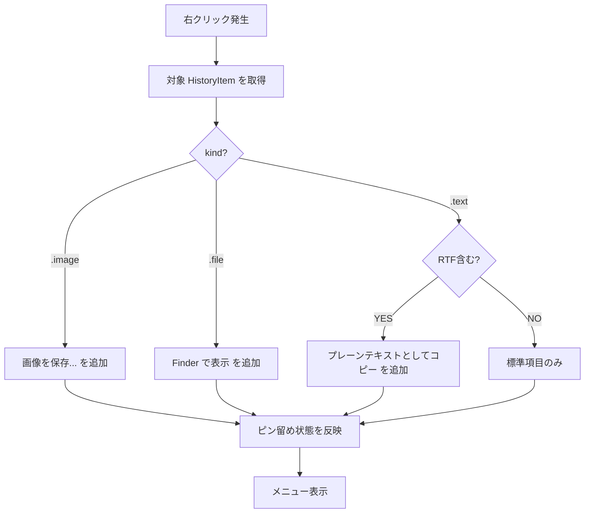

# clip-shelf - 右クリックコンテキストメニュー仕様（フロントエンド）

> **機能**: [clip-shelf](./index.md)
> **ステータス**: 下書き
> **対応モック**: `design/05-context-menu.html`

## 概要

履歴項目（行）を右クリック / `Control + クリック` した時に出るコンテキストメニュー。`MenuBarDropdown` / `PastePicker` / `HistoryWindow` の3サーフェスで共通利用される。

## サーフェス

| 項目 | 仕様 |
|:-----|:-----|
| 種別 | SwiftUI の `.contextMenu` モディファイア（内部的には `NSMenu`） |
| 表示位置 | カーソル位置直下 |
| 共通利用 | `MenuBarDropdown` / `PastePicker` / `HistoryWindow` の各行が同じ `HistoryItemContextMenu` View を参照 |

## メニュー構成

メニュー項目は履歴項目の型（テキスト / 画像 / ファイル）と状態（ピン留め有無）に応じて出し分ける。

```
┌──────────────────────────────────────┐
│ ▸ 貼り付け                    ⏎     │ ← デフォルト（強調）
│   コピー                      ⌘C    │
├──────────────────────────────────────┤
│   ピン留め                    ⌘P    │ ← ピン留め時は「ピン留めを解除」
│   ▸ プレーンテキストとしてコピー    │ ← テキスト型のみ
│   ▸ Finder で表示                   │ ← ファイル型のみ
│   ▸ 画像を保存...                   │ ← 画像型のみ
├──────────────────────────────────────┤
│   詳細を見る                        │ ← 履歴ブラウザで該当行を開く
│   履歴から削除                ⌫    │ ← 赤色表示
└──────────────────────────────────────┘
```

## メニュー項目詳細

| 項目 | 表示条件 | ショートカット | 動作 |
|:-----|:--------|:-------------|:-----|
| 貼り付け | 常に | `Enter` | クリップボード書き戻し + `Cmd+V` 送信 |
| コピー | 常に | `Cmd + C` | クリップボードに書き戻すのみ |
| ピン留め | ピン留めなしの場合 | `Cmd + P` | `pinned_items` に追加 |
| ピン留めを解除 | ピン留めありの場合 | `Cmd + P` | `pinned_items` から削除 |
| プレーンテキストとしてコピー | 型が `.text` かつ RTF 装飾を持つ場合 | - | 装飾を捨てて UTF-8 のみクリップボードへ書き戻し |
| Finder で表示 | 型が `.file` | - | `NSWorkspace.activateFileViewerSelecting` |
| 画像を保存... | 型が `.image` | - | 保存ダイアログ → PNG / JPEG / TIFF を選んで保存 |
| 詳細を見る | 常に | - | `HistoryWindow` を開き、該当行を選択状態にする |
| 履歴から削除 | 常に | `Backspace` | 確認なしで削除（直後にトースト「削除しました [元に戻す]」） |

### 出し分けロジック



## ユーザー操作

| 操作 | トリガー | 振る舞い |
|:-----|:--------|:---------|
| メニュー表示 | 行を右クリック / `Ctrl + クリック` / 2本指タップ | メニュー表示。元の行はハイライト状態を保つ |
| 項目選択 | クリック / 矢印 + Enter | 該当アクション実行、メニュー閉じる |
| メニュー閉じる | `Esc` / 外側クリック | メニュー閉じる、行のハイライトは維持 |

## アクセシビリティ

| 観点 | 対応方針 |
|:-----|:---------|
| キーボード | メニュー内を ↑↓ で移動、`Enter` で選択、`Esc` で閉じる |
| VoiceOver | 各項目に `accessibilityLabel`、破壊的項目には警告フラグ |
| ショートカット表示 | 各行右側にショートカットを通常テキストで表示（読み上げ対象） |

## アンドゥ

| 操作 | アンドゥ可否 | 方法 |
|:-----|:-----------|:-----|
| 削除 | 可（10秒以内） | 削除時のトーストに「元に戻す」ボタン |
| ピン留め | 即時切替なのでアンドゥ不要 | もう一度切替 |

トーストは画面下中央に 10秒間表示。トーストの「元に戻す」を押すと、削除した `HistoryItem` を `createdAt` の元位置に挿入し直す。

## エラー表示

| エラーケース | 表示方法 |
|:------------|:---------|
| 画像保存失敗（権限・容量） | 保存ダイアログ後にアラート |
| クリップボード書き戻し失敗 | 該当行に赤いインジケータを 2秒 |
| Finder で表示で対象が存在しない | アラート「ファイルが見つかりません」 |

## 制限事項

- メニュー項目は履歴1件に対する操作のみ。複数選択でのバッチ操作は `HistoryWindow` のツールバーに委譲
- 「元に戻す」のアンドゥは削除のみ。ピン留め切替のアンドゥは不要と判断

## 関連仕様

- [menubar-dropdown-spec.md](./menubar-dropdown-spec.md) — 行で使用
- [paste-picker-spec.md](./paste-picker-spec.md) — 行で使用
- [history-spec.md](./history-spec.md) — 行で使用 + 「詳細を見る」の遷移先
- [persistence-spec.md](./persistence-spec.md) — `togglePin`, `delete`, `restore` API
