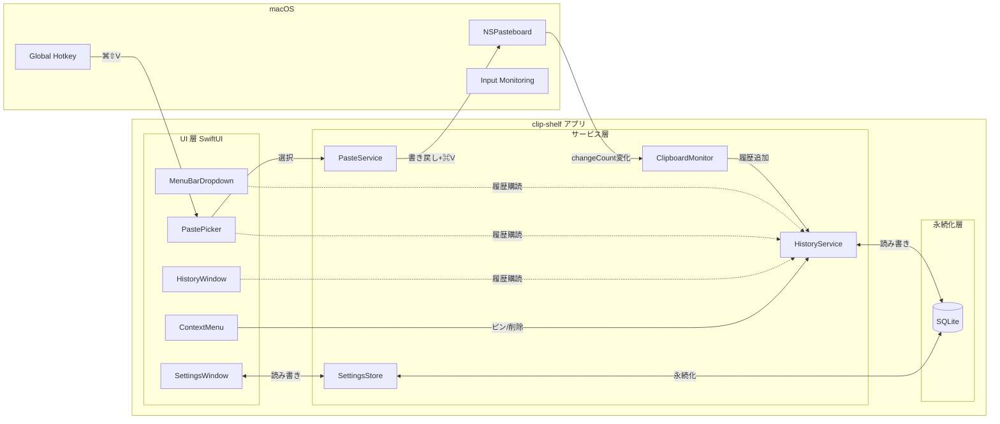
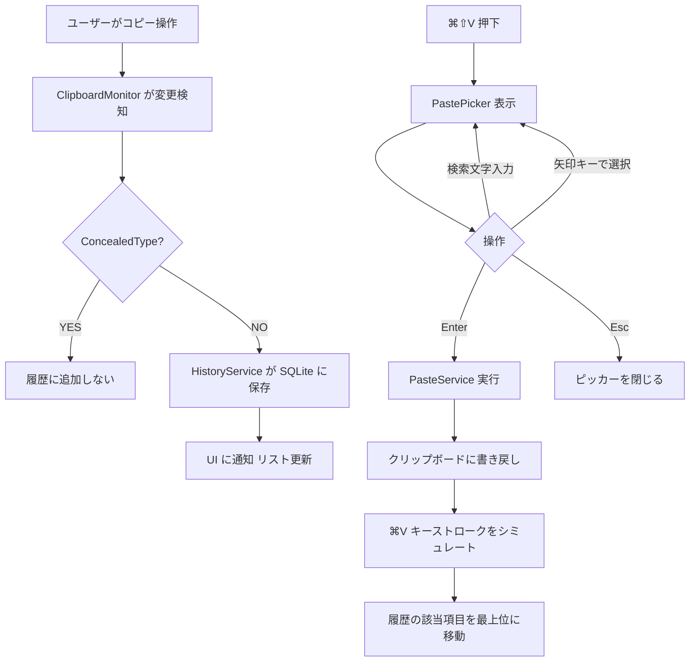

# clip-shelf

> **バージョン**: 1.0
> **作成日**: 2026-05-12
> **作成者**: DIO0550
> **ステータス**: 下書き

## 概要

`clip-shelf` は macOS のクリップボード履歴を管理する個人利用向けネイティブアプリ。Windows の `Win + V` 相当の体験を Mac で再現することを目的に、メニューバー常駐 + グローバルショートカットでの履歴呼び出し + 履歴ブラウザ + 設定UIを提供する。

## 背景

macOS の標準クリップボードは直近1件しか保持できないため、複数の値を順に貼り付ける作業（コード片・URL・テンプレ文の連続ペーストなど）で効率が落ちる。Windows ユーザーが慣れた `Win + V` の体験を、最小機能・ローカル完結・無償（自分用）で再現したい。詳細な背景・ゴールは [PRD](../prd-mac-clipboard-history.md) を参照。

## スコープ

**対象範囲**:

- メニューバー常駐 + ドロップダウン（直近履歴と主要アクションの表示）
- `Cmd + Shift + V` で開く貼り付けピッカー（フローティング）
- 履歴ブラウザウィンドウ（サイドバー + リスト + プレビューの3カラム）
- 設定ウィンドウ（標準 macOS ウィンドウ、トラフィックライト付き）
- 履歴項目の右クリックコンテキストメニュー
- クリップボード自動監視（NSPasteboard `changeCount` ポーリング）
- 自動ペースト（クリップボード書き戻し + `Cmd + V` シミュレート）
- SQLite による履歴の永続化（GRDB.swift）
- ライト / ダーク / システム追従のテーマ切替

**対象外**:

- 公開・配布（App Store / GitHub Releases）
- 暗号化（FileVault に任せる、アプリ側は平文 SQLite）
- クラウド同期 / 複数デバイス共有
- スニペット管理 / AI 連携 / テンプレ機能
- 国際化（日本語のみ）
- iOS / iPadOS 版

## ユーザーストーリー

| ID | 〜として | 〜したい | 〜のために | 優先度 |
|:---|:---------|:---------|:-----------|:-------|
| US-001 | 自分（開発者） | `Cmd + Shift + V` で過去のコピー履歴を呼び出して貼り付けたい | 複数の値を順番に貼り付ける作業を効率化するため | 高 |
| US-002 | 自分 | メニューバーから直近履歴をすぐに見たい | ショートカットを使わずに目視で内容確認したいため | 高 |
| US-003 | 自分 | 履歴ブラウザで過去全件を検索・プレビューしたい | 何日か前にコピーした内容をピンポイントで取り出すため | 中 |
| US-004 | 自分 | パスワードマネージャからコピーした内容は履歴に残したくない | 機密情報が SQLite に書き込まれないようにするため | 高 |
| US-005 | 自分 | 履歴項目をピン留めしたい | 頻用するテンプレ文を上位に固定するため | 低 |
| US-006 | 自分 | 設定で履歴の上限件数やショートカットを変更したい | 自分のマシン性能と他アプリのショートカットに合わせるため | 中 |
| US-007 | 自分 | ライト/ダークモードを選びたい | 時間帯や好みに応じて見やすさを変えるため | 中 |

## 全体アーキテクチャ

## 処理フロー

## 仕様書一覧

| 仕様書 | 種別 | 説明 |
|:-------|:-----|:-----|
| [menubar-dropdown-spec.md](./menubar-dropdown-spec.md) | FE | メニューバー常駐アイコン + ドロップダウンパネル |
| [paste-picker-spec.md](./paste-picker-spec.md) | FE | `⌘⇧V` で表示するフローティング貼り付けピッカー |
| [history-spec.md](./history-spec.md) | FE | 履歴ブラウザウィンドウ（3カラム） |
| [settings-spec.md](./settings-spec.md) | FE | 設定ウィンドウ |
| [context-menu-spec.md](./context-menu-spec.md) | FE | 履歴項目の右クリックメニュー |
| [clipboard-monitor-spec.md](./clipboard-monitor-spec.md) | BE | クリップボード監視と自動ペースト |
| [persistence-spec.md](./persistence-spec.md) | BE | 履歴サービスと SQLite 永続化層 |
| [history-table-spec.md](./history-table-spec.md) | DB | `history` / `pinned_items` / `settings_kv` テーブル |
| [technical-spec.md](./technical-spec.md) | 横断 | 技術スタック・モジュール構成・エラー方針 |

## 非機能要件

| カテゴリ | 要件 | 目標値 |
|:---------|:-----|:-------|
| パフォーマンス | ピッカー表示遅延 | 100ms 以下（履歴 500件時） |
| パフォーマンス | アイドル時 CPU | 1% 未満 |
| パフォーマンス | 常駐メモリ | 50MB 以下 |
| 互換性 | 対応 OS | macOS 14 以降 |
| 互換性 | アーキ | Apple Silicon |
| 外観 | テーマ | システム追従 / ライト / ダーク の3択 |

## 用語集

| 用語 | 定義 |
|:-----|:-----|
| 履歴項目 (HistoryItem) | クリップボードに入った1件分のデータ。テキスト/画像/ファイルパスのいずれかの型を持つ |
| ピン留め | 履歴項目をリスト上部に固定する操作。`pinned_items` テーブルで管理 |
| ConcealedType | NSPasteboard における「機密扱い」ヒント型。1Password 等が付与し、履歴アプリは尊重して保存をスキップする |
| サーフェス | UI が表示される面の単位（メニューバー / ピッカー / ウィンドウ / コンテキストメニュー） |
| 自動ペースト | 履歴選択後、クリップボードに値を書き戻して `Cmd+V` キーストロークを送信し、アクティブアプリへ貼り付ける操作 |

## 変更履歴

| バージョン | 日付 | 変更内容 | 変更者 |
|:-----------|:-----|:---------|:-------|
| 1.0 | 2026-05-12 | 初版作成 | DIO0550 |
