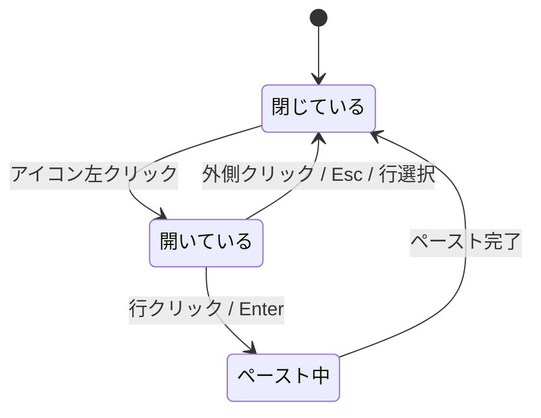

# clip-shelf - メニューバードロップダウン仕様（フロントエンド）

> **機能**: [clip-shelf](./index.md)
> **ステータス**: 下書き
> **対応モック**: `design/01-menubar-dropdown.html`

## 概要

メニューバー（macOS 画面上端）に常駐するアイコンと、クリックで開く軽量ドロップダウンパネルの仕様。直近の履歴とアクション（履歴ブラウザを開く、ピッカーを開く、設定を開く、終了）を素早く呼び出す導線となる。

## サーフェス

| サーフェス | 種別 | 説明 |
|:---------|:----|:----|
| メニューバーアイコン | `NSStatusItem`（長さ可変） | 画面右上のメニューバーに常駐する小アイコン |
| ドロップダウンパネル | `NSPopover`（または `NSPanel`） | アイコンクリックで開く 280×420 程度のパネル |

`NSPopover` を採用する。理由: フォーカス喪失で自動的に閉じ、メニューバー直下に自然に位置決めされるため。

## レイアウト

```
   ┌─────────────────────────────[ メニューバー ]─────[📋]─┐
                                                          ▼
                                          ┌──────────────────────────┐
                                          │  最近のコピー            │ ← ヘッダー
                                          │ ┌──────────────────────┐ │
                                          │ │ ▸ https://example..  │ │ ← 履歴 #1（ハイライト）
                                          │ └──────────────────────┘ │
                                          │ ┌──────────────────────┐ │
                                          │ │   git rebase -i HE.. │ │ ← 履歴 #2
                                          │ └──────────────────────┘ │
                                          │ ┌──────────────────────┐ │
                                          │ │   diot12345@yahoo... │ │ ← 履歴 #3
                                          │ └──────────────────────┘ │
                                          │ ┌──────────────────────┐ │
                                          │ │   [image 320×180]    │ │ ← 履歴 #4
                                          │ └──────────────────────┘ │
                                          │ ──────────────────────── │ ← 区切り
                                          │ 履歴ブラウザを開く...    │
                                          │ ピッカーを開く  ⌘⇧V     │
                                          │ 設定...         ⌘,      │
                                          │ clip-shelf を終了        │
                                          └──────────────────────────┘
```

## コンポーネント

| コンポーネント | 種別 | 説明 | 振る舞い |
|:-------------|:-----|:-----|:---------|
| `MenuBarIcon` | `Image` を伴う `NSStatusItem` | クリップボードを模した SF Symbol 系アイコン | クリックで `NSPopover` を表示 / 副クリックで `NSMenu` |
| `MenuBarDropdownView` | SwiftUI `View` | ポップオーバー内の全体ビュー | ヘッダー + 履歴行 + 区切り + アクション行 |
| `MenuBarHistoryRow` | SwiftUI `View` | 履歴1件を表示する行 | 文字列はプレビュー文（1行最大40文字に省略）。画像はサムネイル |
| `MenuBarActionRow` | SwiftUI `View` | アクション1件を表示する行 | ラベル + 右側にショートカット表示。クリックで実行 |

## ユーザー操作

| 操作 | トリガー | 振る舞い |
|:-----|:--------|:---------|
| パネルを開く | アイコンを左クリック | ポップオーバー表示 |
| メニューを開く | アイコンを右クリック | 簡易 `NSMenu`（履歴ブラウザを開く / 設定 / 終了） |
| パネルを閉じる | 外側クリック / `Esc` | ポップオーバーを閉じる |
| 履歴をペースト | 行クリック / `Enter` | 選択行をクリップボードへ書き戻し、ポップオーバーを閉じ、`Cmd+V` シミュレート |
| 履歴を選んでコピーのみ | `Cmd` 押下しながら行クリック | クリップボードに書き戻すだけで `Cmd+V` は送らない |
| 履歴ブラウザを開く | アクション行クリック | `HistoryWindow` を表示し、ポップオーバーを閉じる |
| ピッカーを開く | アクション行クリック | `PastePicker` を表示し、ポップオーバーを閉じる |
| 設定を開く | アクション行クリック | `SettingsWindow` を表示し、ポップオーバーを閉じる |
| アプリを終了 | アクション行クリック | `NSApp.terminate(nil)` |

## キーボード操作

| キー | 動作 |
|:-----|:-----|
| ↑ / ↓ | 履歴行のハイライト移動 |
| `Enter` | ハイライト行をペースト |
| `Cmd + Enter` | ハイライト行をクリップボードに書き戻すのみ |
| `Esc` | ポップオーバーを閉じる |
| `1`〜`5` | 数字に対応する履歴行をペースト（ショートカット） |

## 表示データ

履歴は `HistoryService.recentItems(limit: 5)` から取得する。`Combine` の `@Published` を通じてリアルタイムに更新される。

| フィールド | ソース | フォーマット | 空の場合 |
|:----------|:-------|:------------|:---------|
| 行のプレビュー | `HistoryItem.previewText` | 1行・最大40文字。改行は `↵` に置換 | 「履歴がありません」のプレースホルダ行を1行表示 |
| 行のサムネイル | `HistoryItem.thumbnail` | 画像型のみ表示、最大 32×32 にダウンサイズ | テキストアイコンを表示 |
| 行の型アイコン | `HistoryItem.kind` | テキスト/画像/ファイル の SF Symbol | - |

## 状態管理

| 状態名 | 型 | 初期値 | 更新トリガー |
|:-------|:---|:-------|:-----------|
| `isPopoverShown` | `Bool` | `false` | アイコンクリック / フォーカス喪失 |
| `highlightedIndex` | `Int?` | `nil` | 矢印キー操作 / マウスホバー |
| `recentItems` | `[HistoryItem]` | `[]` | `HistoryService` の発行する変更通知 |

### 状態遷移図



## アニメーション

| 対象 | トリガー | アニメーション | 時間 |
|:-----|:--------|:-------------|:-----|
| ポップオーバー | 開閉 | `NSPopover` 標準のフェード | 約 150ms（システム依存） |
| 行ハイライト | ホバー / キー移動 | 背景色のフェード | 80ms |

## アクセシビリティ

| 観点 | 対応方針 |
|:-----|:---------|
| キーボード操作 | アイコンに `Cmd + Shift + V` の代替として右クリック → 「履歴ブラウザを開く」を案内 |
| VoiceOver | 行に `accessibilityLabel`（型 + プレビュー文）、アクション行に `accessibilityHint` |
| カラーコントラスト | システムカラー（`Color.primary` / `Color.secondary`）に従う |

## エラー表示

| エラーケース | 発生条件 | 表示方法 |
|:------------|:---------|:---------|
| 履歴が空 | 起動直後・全削除直後 | パネル中央に「履歴がありません」グレー表示 |
| ペースト失敗 | キーストローク送信に Accessibility 権限不足 | 行に赤いインジケータを 2秒表示し、設定画面で権限確認を促すリンクを表示 |

## パフォーマンス

| 指標 | 目標値 | 対策 |
|:-----|:-------|:-----|
| パネル表示遅延 | 80ms 以下 | ポップオーバーを事前生成し、`recentItems` を `@Published` で購読しておく |
| サムネイル生成 | バックグラウンドスレッドで非同期 | 一度生成したサムネイルは `HistoryItem.thumbnail` にキャッシュ |

## 制限事項

- ポップオーバー幅 280px に収まらない長文は省略表示のみ。フル表示は履歴ブラウザに委譲する
- ピン留めの編集は本サーフェスでは行わない（コンテキストメニュー / 履歴ブラウザに委譲）

## 関連仕様

- [paste-picker-spec.md](./paste-picker-spec.md) — フローティングピッカー（より高機能なペースト導線）
- [history-spec.md](./history-spec.md) — 履歴ブラウザ（全件閲覧）
- [context-menu-spec.md](./context-menu-spec.md) — 履歴行に対する右クリックメニュー
- [clipboard-monitor-spec.md](./clipboard-monitor-spec.md) — 履歴の発生源
- [persistence-spec.md](./persistence-spec.md) — `HistoryService` のインターフェース
