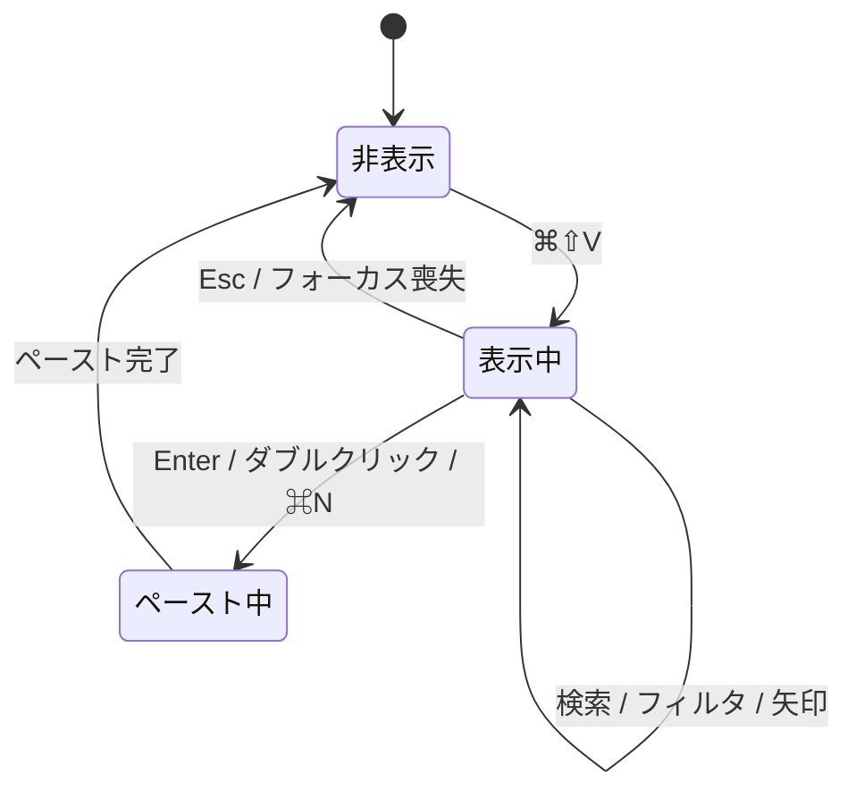

# clip-shelf - 貼り付けピッカー仕様（フロントエンド）

> **機能**: [clip-shelf](./index.md)
> **ステータス**: 下書き
> **対応モック**: `design/02-paste-picker.html`

## 概要

グローバルショートカット `Cmd + Shift + V` で呼び出すフローティングピッカー。Windows の `Win + V` を最も忠実に再現する主要 UI で、検索・フィルタ・自動ペーストの中心となる。

## サーフェス

| 項目 | 仕様 |
|:-----|:-----|
| 種別 | `NSPanel`（`HUDWindow` スタイル、`nonactivatingPanel` 属性） |
| サイズ | 幅 480px × 高さ 420px（リスト件数に応じて 240〜420px の可変） |
| 位置 | カーソル近傍を優先、画面端で見切れる場合はクランプ。マルチディスプレイ環境はアクティブなディスプレイに表示 |
| 振る舞い | フォーカス取得時にアクティブアプリのフォーカスは失わない（書き戻し後の `Cmd+V` 送信のため） |

`nonactivatingPanel` にする理由: 通常の `NSWindow` だとアクティブ化で背面アプリにフォーカスが移ってしまい、`Cmd+V` 送信先が変わる。

## レイアウト

```
┌──────────────────────────────────────────────────────────┐
│ 🔍 検索...                                          ⎋    │ ← 検索バー
├──────────────────────────────────────────────────────────┤
│ [すべて] [テキスト] [画像] [ファイル] [ピン留め]         │ ← フィルタチップ
├──────────────────────────────────────────────────────────┤
│ ▸ https://example.com/some/long/url-that-is-long...     │ ← ハイライト中
│   📋 30秒前                                        ⌘1   │
├──────────────────────────────────────────────────────────┤
│   git rebase -i HEAD~5                                   │
│   📋 2分前                                         ⌘2   │
├──────────────────────────────────────────────────────────┤
│   [image 320×180 thumbnail]   IMG_2026-05-12.png         │
│   📋 5分前                                         ⌘3   │
├──────────────────────────────────────────────────────────┤
│   diot12345@yahoo.co.jp                                  │
│   📋 12分前                                        ⌘4   │
├──────────────────────────────────────────────────────────┤
│ ↑↓ 選択   ⏎ 貼り付け   ⌘⏎ コピーのみ   ⎋ 閉じる         │ ← ヒント
└──────────────────────────────────────────────────────────┘
```

## コンポーネント

| コンポーネント | 種別 | 説明 |
|:-------------|:-----|:-----|
| `PastePickerView` | SwiftUI `View` | ピッカー全体のルート |
| `SearchField` | SwiftUI `TextField` | フォーカス自動付与、`onSubmit` で先頭ヒット項目をペースト |
| `FilterChips` | カスタム `View` | 5つのフィルタを横並びに。選択中はアクセント色塗り |
| `HistoryList` | `List` または `LazyVStack` | フィルタ後の履歴を仮想化リストで表示 |
| `HistoryRowLarge` | カスタム `View` | プレビュー2行 + メタ情報 + 番号ショートカット表記 |
| `HintBar` | カスタム `View` | 下部のキーボードヒント |

## ユーザー操作

| 操作 | トリガー | 振る舞い |
|:-----|:--------|:---------|
| ピッカー表示 | グローバル `Cmd + Shift + V` | パネル表示、検索フィールドにフォーカス、リスト先頭をハイライト |
| インクリメンタル検索 | 検索フィールドへの入力 | 50ms 以内にリストを絞り込み |
| フィルタ切替 | チップクリック / `Tab` で循環 | リストをそのカテゴリに絞り込み。検索文字列とは AND 条件 |
| 行選択 | ↑↓ 矢印 / マウスホバー | ハイライト移動 |
| ペースト | `Enter` / 行ダブルクリック | クリップボードへ書き戻し → ピッカー閉じる → `Cmd+V` 送信 |
| コピーのみ | `Cmd + Enter` / `Cmd` + 行クリック | クリップボードに書き戻すだけで `Cmd+V` は送らない |
| 番号ショートカット | `Cmd + 1〜9` | 上から N 番目の項目をペースト |
| 閉じる | `Esc` / フォーカス喪失 | パネルを閉じる |

## キーボードショートカット

| キー | 動作 |
|:-----|:-----|
| `Cmd + Shift + V` | ピッカーを開く（グローバル） |
| `↑` / `↓` | リスト内移動 |
| `Page Up` / `Page Down` | 10行ずつ移動 |
| `Home` / `End` | 先頭 / 末尾 |
| `Enter` | ペースト |
| `Cmd + Enter` | クリップボード書き戻しのみ |
| `Cmd + Backspace` | ハイライト行を削除（履歴から） |
| `Cmd + P` | ハイライト行をピン留め切替 |
| `Cmd + 1〜9` | N 番目の行をペースト |
| `Tab` | フィルタチップを循環 |
| `Esc` | 閉じる |

## 状態管理

| 状態名 | 型 | 初期値 | 更新トリガー |
|:-------|:---|:-------|:-----------|
| `isVisible` | `Bool` | `false` | ホットキー押下 / フォーカス喪失 / Esc |
| `query` | `String` | `""` | 検索フィールド入力 |
| `filter` | `enum HistoryFilter { all, text, image, file, pinned }` | `.all` | チップクリック |
| `items` | `[HistoryItem]` | `[]` | `HistoryService` 購読 + `query` / `filter` の変更 |
| `highlightedIndex` | `Int` | `0` | 矢印キー / ホバー / フィルタ変更（先頭リセット） |
| `isPasting` | `Bool` | `false` | ペースト開始 → 完了で `false` |

### 状態遷移図



## 表示データ

| フィールド | ソース | フォーマット |
|:----------|:-------|:------------|
| プレビュー本文 | `HistoryItem.previewText` | 最大2行、改行は保持、超過は `…` |
| メタ情報 | `HistoryItem.kind` + `HistoryItem.createdAt` | `📋 N秒前` 形式の相対時刻 |
| サムネイル | `HistoryItem.thumbnail` | 画像型のみ。最大 96×64px |
| ピン留めバッジ | `HistoryItem.isPinned` | ピン留め時は左端にアクセント色の小バーを表示 |
| 番号ショートカット | リスト位置 | 上位9件のみ `⌘1`〜`⌘9` を表示 |

## アニメーション

| 対象 | トリガー | アニメーション | 時間 |
|:-----|:--------|:-------------|:-----|
| パネル全体 | 表示 | フェード + 軽い上方スケール（0.98 → 1.0） | 120ms |
| パネル全体 | 閉じる | フェードアウト | 80ms |
| リスト行 | ハイライト切替 | 背景色トランジション | 60ms |
| ペースト時 | 確定 | ハイライト行を一瞬光らせる | 80ms |

## アクセシビリティ

| 観点 | 対応方針 |
|:-----|:---------|
| キーボード操作 | マウスなしで全機能アクセス可能 |
| VoiceOver | 各行に `accessibilityLabel`（型 + プレビュー）、ハイライト時に `accessibilitySelected` |
| カラーコントラスト | システムカラー / システムアクセント追従 |
| フォーカス管理 | 表示時に検索フィールドへ自動フォーカス。閉じた時に元アプリへフォーカスを返す |

## エラー表示

| エラーケース | 発生条件 | 表示方法 |
|:------------|:---------|:---------|
| 検索ヒット 0 件 | フィルタ済みリストが空 | 中央に「該当する履歴がありません」グレー表示 |
| Accessibility 権限不足 | `Cmd+V` シミュレートに失敗 | 下部に赤いバナー「Accessibility 権限が必要です」+ 設定リンク |
| グローバルホットキー登録失敗 | 別アプリと競合 | 起動時に通知バナー「`⌘⇧V` が他アプリと競合しています」 + 設定リンク |

## パフォーマンス

| 指標 | 目標値 | 対策 |
|:-----|:-------|:-----|
| 表示開始遅延 | 100ms 以下（履歴 500件時） | パネルとビュー階層を起動時に生成しキャッシュ |
| 検索フィルタ反映 | 50ms 以下 | SQLite 側でなく、メモリ上の最近 500件配列で `String.contains` |
| 仮想化リスト | 1000件超でもスムーズ | `LazyVStack` + `id` の安定化 |

## 制限事項

- 画像ペーストは元データを保持しているため、再ペースト時も元の解像度・型で復元する
- リッチテキスト（RTF）は型ごと保存。プレーン化ペーストは将来検討
- マルチディスプレイで「直前のアクティブディスプレイ」を判定できないエッジケースでは、メインディスプレイ中央に表示

## 関連仕様

- [menubar-dropdown-spec.md](./menubar-dropdown-spec.md) — 軽量版の代替導線
- [history-spec.md](./history-spec.md) — フル機能ブラウザ
- [context-menu-spec.md](./context-menu-spec.md) — 行を右クリックした際の追加操作
- [clipboard-monitor-spec.md](./clipboard-monitor-spec.md) — ホットキー登録と自動ペースト
- [persistence-spec.md](./persistence-spec.md) — `HistoryService` の検索 / フィルタ API
