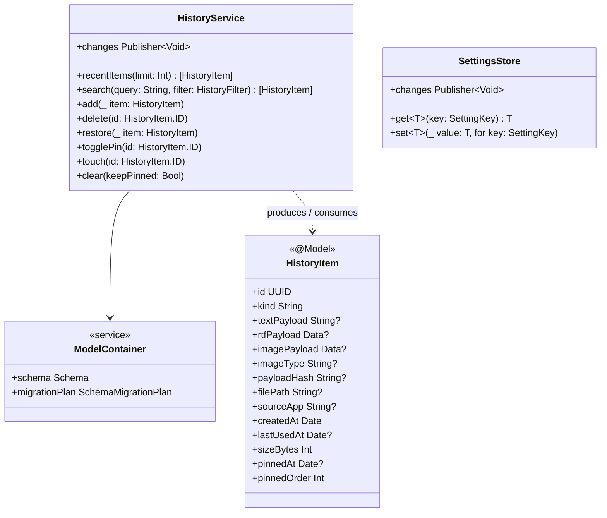
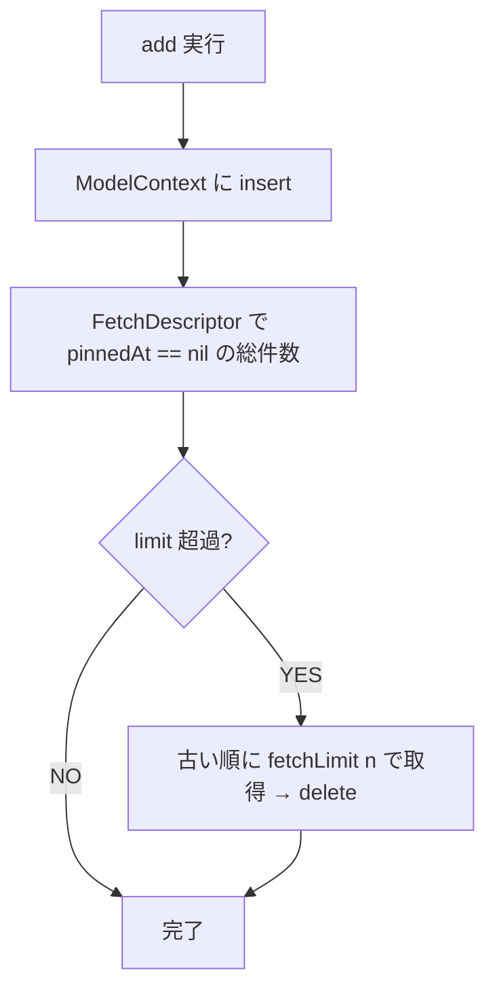
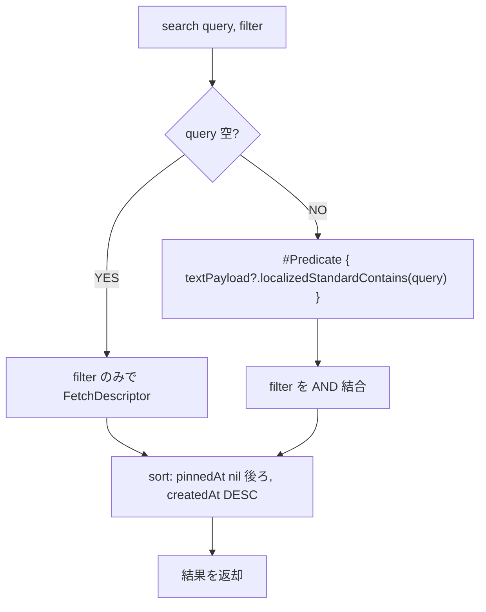
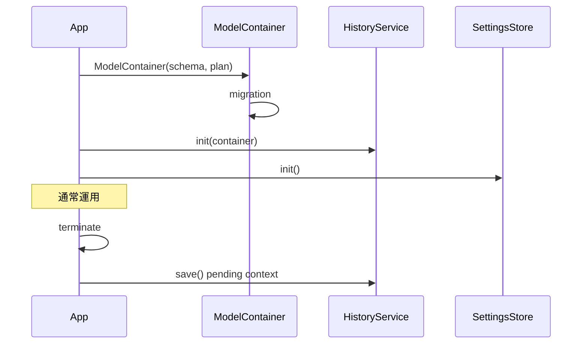

# clip-shelf - 履歴サービス・永続化仕様（バックエンド）

> **機能**: [clip-shelf](./index.md)
> **ステータス**: 下書き

## 概要

履歴データのドメインモデル、検索・追加・削除・ピン留めの API を提供する `HistoryService`、アプリ設定を提供する `SettingsStore`、それらの背後にある SwiftData（裏で SQLite）の永続化層仕様。

## モジュール構成



## ドメインモデル

### HistoryItem

SwiftData の `@Model` として定義。`Kind` は `String` の `RawRepresentable` enum として保存する（SwiftData は enum を直接保存できるが、`String` バックでスキーマ可読性を優先）。

```swift
import SwiftData

@Model
final class HistoryItem {
    enum Kind: String, Codable {
        case text
        case image
        case file
    }

    @Attribute(.unique) var id: UUID
    var kindRaw: String                  // Kind.rawValue
    var textPayload: String?
    var rtfPayload: Data?
    var imagePayload: Data?              // PNG/JPEG/TIFF の生バイト
    var imageType: String?               // UTI 文字列 e.g. "public.png"
    var payloadHash: String?             // 画像 / 長文テキストの SHA-256（重複判定用）
    var filePath: String?
    var sourceApp: String?
    var createdAt: Date
    var lastUsedAt: Date?
    var sizeBytes: Int

    // ピン留めは別 @Model にせず本テーブルにフラットに持つ
    var pinnedAt: Date?
    var pinnedOrder: Int                 // 0 = 非ピン、>0 で上位ほど小さい

    var kind: Kind { Kind(rawValue: kindRaw) ?? .text }
    var isPinned: Bool { pinnedAt != nil }

    init(id: UUID = UUID(),
         kind: Kind,
         createdAt: Date = .now,
         sizeBytes: Int = 0) {
        self.id = id
        self.kindRaw = kind.rawValue
        self.createdAt = createdAt
        self.sizeBytes = sizeBytes
        self.pinnedOrder = 0
    }
}
```

派生プロパティ（プレビューテキストやサムネイル）は View 側の拡張 or ViewModel で計算する。`@Model` の保存対象を増やさないこと。

### HistoryFilter

```swift
enum HistoryFilter {
    case all
    case text
    case image
    case file
    case pinned
    case period(DateInterval)
}
```

## HistoryService

### 公開 API

| メソッド | 戻り値 | 説明 |
|:--------|:------|:-----|
| `recentItems(limit: Int = 5)` | `[HistoryItem]` | 直近 N 件をピン留めを上位優先で返す |
| `search(query: String, filter: HistoryFilter)` | `[HistoryItem]` | `#Predicate` でテキスト部分一致 + フィルタ |
| `add(_ item: HistoryItem)` | `Void` | 履歴に追加。重複判定の上で挿入 or タッチ |
| `delete(id: UUID)` | `Void` | 物理削除 |
| `restore(_ item: HistoryItem)` | `Void` | アンドゥ用の再挿入 |
| `togglePin(id: UUID)` | `Void` | `pinnedAt` の付け外し |
| `touch(id: UUID)` | `Void` | `lastUsedAt` を現在時刻に更新 |
| `clear(keepPinned: Bool)` | `Void` | 全削除（オプションでピン留めは残す） |
| `changes` | `AnyPublisher<Void, Never>` | 変更通知（UI 購読用） |

### 実装方針

- バックグラウンド作業は `@ModelActor` の専用 actor `HistoryActor` に分離。`ClipboardMonitor` からの `add` も `HistoryActor` 上で実行
- UI 層は `@Query` マクロまたは `ModelContext`（メインアクタ）を介して読み取り
- `changes` は `NotificationCenter` の `ModelContext.didSave` をブリッジして発行

### 重複判定ルール

`add()` 内で以下の重複チェックを行う（`FetchDescriptor` + `#Predicate` で同値を検索）。

| 型 | 一致条件 | 一致時の挙動 |
|:---|:--------|:-------------|
| `.text` | `textPayload` 完全一致（長文時は `payloadHash` 一致） | 既存項目の `createdAt` を更新（最上位に移動） |
| `.image` | `payloadHash`（SHA-256）一致 | 既存項目の `createdAt` を更新 |
| `.file` | `filePath` 一致 | 既存項目の `createdAt` を更新 |

長文テキスト（1024 バイト超）は `payloadHash` を埋めて O(1) で検索可能にする。

### 上限件数の管理

`add()` の後に「`historyLimit` を超える分」を `createdAt` の古い順に削除する。ただし `pinnedAt != nil` の項目は削除しない。



### 検索処理



全文検索インデックス（FTS5）は使わない。`localizedStandardContains` は SwiftData の `#Predicate` で利用可能で、想定レコード数（1,000〜10,000）では十分高速。

### スレッドモデル

| 観点 | 仕様 |
|:-----|:-----|
| 書き込み | `@ModelActor` の `HistoryActor` で直列実行 |
| 読み取り | UI からは `@Query` または `mainContext` を経由 |
| 通知 | `ModelContext.didSave` を購読して `changes` を発火 |
| 同期 | UI 層は基本的に `@Query` で自動更新 |

### エラーハンドリング

| エラー | 発生条件 | 振る舞い |
|:------|:--------|:--------|
| `HistoryError.storeFull` | ディスク容量不足 | クリーンアップを試み、それでも失敗ならエラーを上位に伝搬 |
| `HistoryError.itemNotFound` | 既に削除済の ID | 警告ログ + 何もしない |
| `HistoryError.corruption` | ストア破損（`ModelContainer` 生成失敗等） | アプリ全体に通知、設定画面で「リセット」を促す |

## SettingsStore

`UserDefaults` ベースの薄いラッパー。SwiftUI からは `@AppStorage` で直接バインドする箇所も多いため、`SettingsStore` は型安全な集中アクセス用に位置付ける。

### 公開 API

```swift
final class SettingsStore {
    enum SettingKey: String {
        case launchAtLogin
        case historyLimit
        case respectConcealedType
        case includeImages
        case appearance         // system / light / dark
        case shortcutPicker     // KeyCombo を JSON エンコードして保存
        case shortcutHistory
    }

    func get<T: Codable>(_ key: SettingKey, default: T) -> T
    func set<T: Codable>(_ value: T, for key: SettingKey)
    var changes: AnyPublisher<Void, Never> { get }
}
```

### 永続化

- スカラ値（Bool / Int / String / enum）は `UserDefaults.standard` に保存
- 複合値（`KeyCombo` 等）は JSON エンコードして `Data` で保存
- グローバルショートカットも `SettingsStore` の管理対象に含める（自前実装の `HotkeyService` が `SettingsStore` から読み出して登録する）

`UserDefaults` を採用する理由:

1. macOS 標準で SwiftUI の `@AppStorage` と直接連携できる
2. `SMAppService` のログイン項目登録や OS の各種 API と素直に組み合わせられる
3. 履歴と設定で永続化先を分離することで、履歴ストアのリセット時に設定が消えない

### 変更通知

`UserDefaults.didChangeNotification` をラップして `changes` として発行。特定キーの変更を受け取りたい場合は購読側で都度 `get` する。

## ModelContainer

### 接続

| 項目 | 仕様 |
|:-----|:-----|
| ストアファイル | `~/Library/Application Support/clip-shelf/HistoryStore.sqlite`（SwiftData が SQLite を内部生成） |
| 生成 | `ModelContainer(for: HistoryItem.self, migrationPlan: ClipShelfMigrationPlan.self, configurations: ...)` |
| 設定 | `ModelConfiguration(url: ..., cloudKitDatabase: .none)` で iCloud 同期は明示的に無効 |
| テスト用 | `ModelConfiguration(isStoredInMemoryOnly: true)` でインメモリストアを利用 |

SQLite の PRAGMA（WAL、synchronous 等）は SwiftData がデフォルトで適切に設定するため、アプリ側では指定しない。

### マイグレーション

`VersionedSchema` + `SchemaMigrationPlan` を起動時に自動適用。スキーマバージョンは型として表現する。

| バージョン | 内容 |
|:----------|:-----|
| `SchemaV1` | `HistoryItem` v1（テキスト / 画像 / ファイル + ピン留めフラット保持） |

将来スキーマを変える場合は `SchemaV2`, `SchemaV3` ... を追加し、`MigrationStage.lightweight` または `.custom` で繋ぐ。

### バックアップ / リセット

| 操作 | 方法 |
|:-----|:-----|
| バックアップ | 設定画面から「ストアフォルダを Finder で表示」のみ提供（手動コピー） |
| リセット | 設定 → 「すべての履歴を削除…」、または破損検知時の自動オファー |
| ファイル削除 | アプリを終了してから `~/Library/Application Support/clip-shelf/` ごと削除しても安全（次回起動で初期化） |

## ライフサイクル



## 非機能要件

| 項目 | 目標値 | 計測方法 |
|:-----|:-------|:--------|
| `add` の処理時間 | 10ms 以下 | 内部計測 |
| `search` の処理時間（10,000件、部分一致） | 100ms 以下 | 内部計測 |
| ストアファイルサイズ（500件、画像中心） | 200MB 以下 | 実機 |
| メモリ常駐量（ModelContainer 含む） | 10MB 以下 | Activity Monitor |

## 制限事項

- 画像本体は SwiftData の `Data` 属性として SQLite に BLOB で保存。100MB を超えるような大量画像保存には向かない（個人利用想定として許容）
- 全文検索は `localizedStandardContains` による単純部分一致。形態素解析や高度なランキングはしない
- 履歴データの暗号化はしない（FileVault に依存）

## 関連仕様

- [history-table-spec.md](./history-table-spec.md) — `@Model` 定義詳細
- [clipboard-monitor-spec.md](./clipboard-monitor-spec.md) — `add` の呼び出し元
- [paste-picker-spec.md](./paste-picker-spec.md) — `search` の主要利用先
- [history-spec.md](./history-spec.md) — `search` / `delete` / `togglePin` の主要利用先
- [settings-spec.md](./settings-spec.md) — `SettingsStore` の主要利用先
