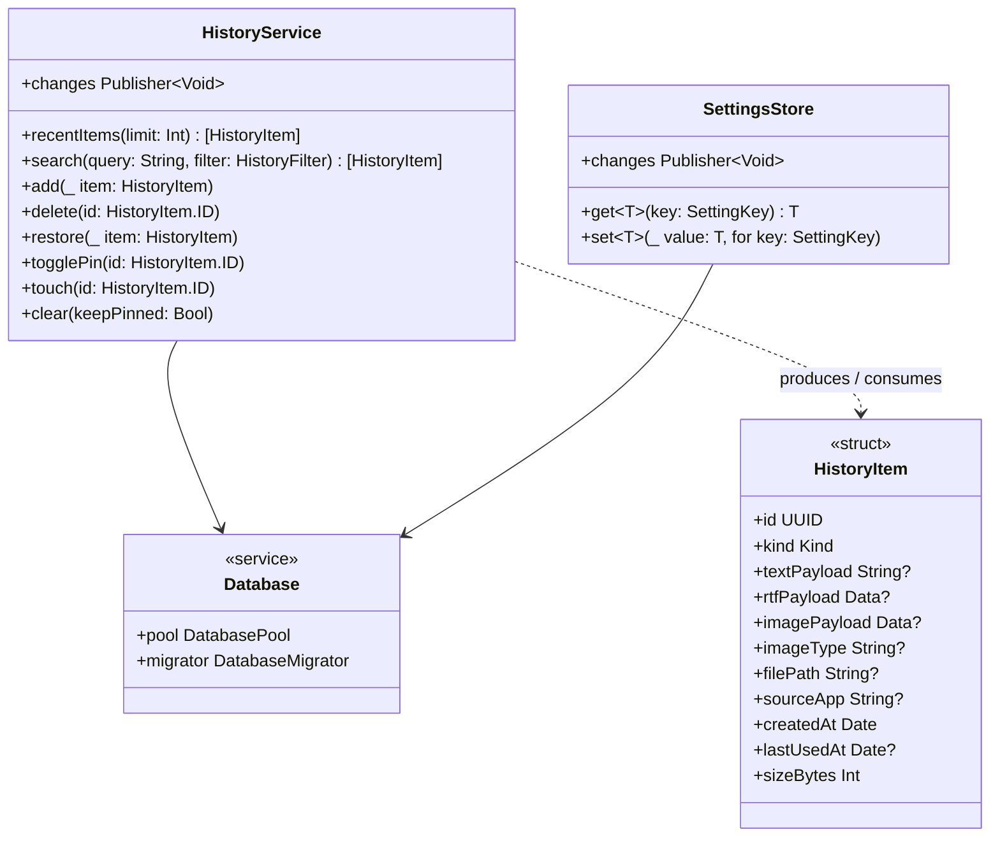
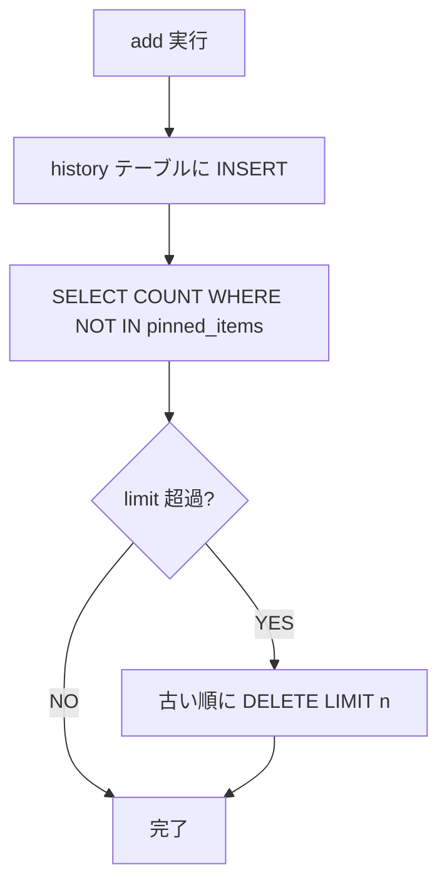
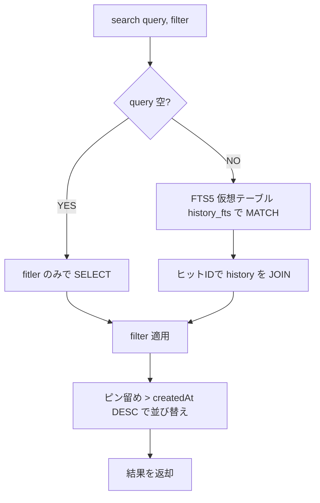
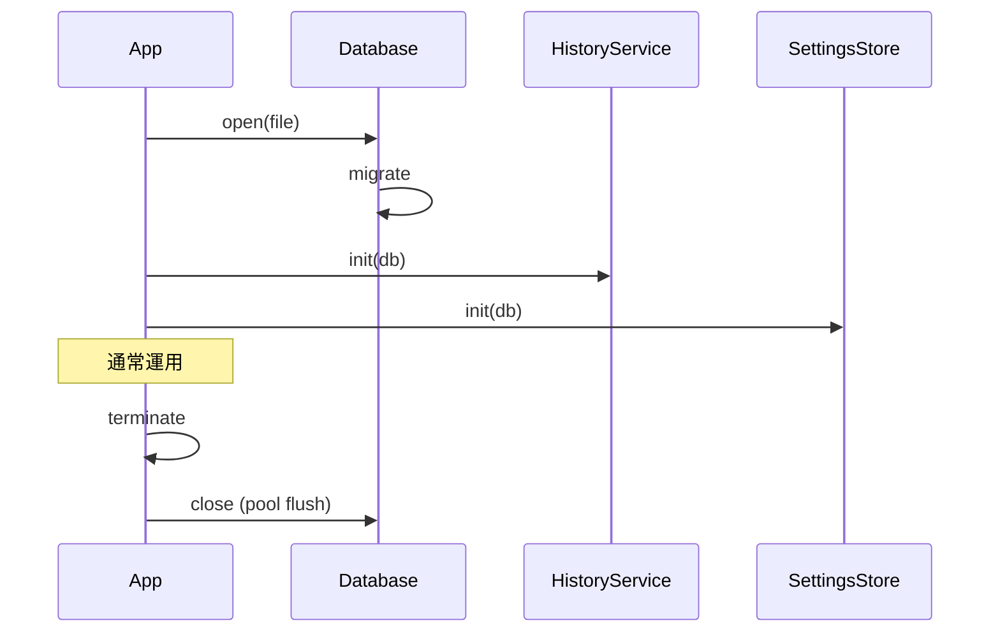

# clip-shelf - 履歴サービス・永続化仕様（バックエンド）

> **機能**: [clip-shelf](./index.md)
> **ステータス**: 下書き

## 概要

履歴データのドメインモデル、検索・追加・削除・ピン留め・設定保存の API を提供する `HistoryService` と `SettingsStore`、それらの背後にある GRDB.swift（SQLite）の永続化層仕様。

## モジュール構成



## ドメインモデル

### HistoryItem

```swift
struct HistoryItem: Identifiable, Hashable, Codable {
    enum Kind: String, Codable {
        case text
        case image
        case file
    }

    let id: UUID
    let kind: Kind

    // テキスト系
    var textPayload: String?      // プレーンテキスト本文
    var rtfPayload: Data?         // RTFがあれば

    // 画像系
    var imagePayload: Data?       // PNG/JPEG/TIFF の生バイト
    var imageType: String?        // UTI 文字列 e.g. "public.png"

    // ファイル系
    var filePath: String?         // 絶対パス

    // メタ
    var sourceApp: String?        // コピー元アプリのバンドルID（取得できれば）
    var createdAt: Date
    var lastUsedAt: Date?         // 最後に paste / copy された時刻
    var sizeBytes: Int            // payload の総バイト数

    // 派生プロパティ
    var previewText: String { ... }
    var thumbnail: NSImage? { ... }   // 画像なら作る、それ以外 nil
    var isPinned: Bool { ... }        // pinned_items から JOIN
}
```

### HistoryFilter

```swift
enum HistoryFilter {
    case all
    case text
    case image
    case file
    case pinned
    case period(DateInterval)
}
```

## HistoryService

### 公開 API

| メソッド | 戻り値 | 説明 |
|:--------|:------|:-----|
| `recentItems(limit: Int = 5)` | `[HistoryItem]` | 直近 N 件をピン留めを上位優先で返す |
| `search(query: String, filter: HistoryFilter)` | `[HistoryItem]` | FTS5 でテキスト検索 + フィルタ |
| `add(_ item: HistoryItem)` | `Void` | 履歴に追加。重複判定の上で挿入 or タッチ |
| `delete(id: UUID)` | `Void` | 物理削除（ピン留め紐付けも削除） |
| `restore(_ item: HistoryItem)` | `Void` | アンドゥ用の再挿入 |
| `togglePin(id: UUID)` | `Void` | `pinned_items` の付け外し |
| `touch(id: UUID)` | `Void` | `lastUsedAt` を現在時刻に更新 |
| `clear(keepPinned: Bool)` | `Void` | 全削除（オプションでピン留めは残す） |
| `changes` | `AnyPublisher<Void, Never>` | 変更通知（UI 購読用） |

### 重複判定ルール

`add()` 内で以下の重複チェックを行う。

| 型 | 一致条件 | 一致時の挙動 |
|:---|:--------|:-------------|
| `.text` | `textPayload` が完全一致 | 既存項目の `createdAt` を更新（最上位に移動） |
| `.image` | `imagePayload` の SHA-256 が一致 | 既存項目の `createdAt` を更新 |
| `.file` | `filePath` が一致 | 既存項目の `createdAt` を更新 |

ハッシュは `image_hash` カラムに保存し、INDEX を貼って検索を高速化（[history-table-spec.md](./history-table-spec.md) 参照）。

### 上限件数の管理

`add()` の後に「`historyLimit` を超える分」を `createdAt` の古い順に削除する。ただし `pinned_items` に紐づく項目は削除しない。



### 検索処理



### スレッドモデル

| 観点 | 仕様 |
|:-----|:-----|
| 読み取り | `DatabasePool.read { db in ... }` で並列読み取り |
| 書き込み | `DatabasePool.write { db in ... }` で直列化 |
| 通知 | 書き込みコミット後にメインスレッドで `changes` を発火 |
| 同期 | UI 層は基本的に `@Published` プロパティ経由で間接購読 |

### エラーハンドリング

| エラー | 発生条件 | 振る舞い |
|:------|:--------|:--------|
| `HistoryError.databaseFull` | ディスク容量不足 | クリーンアップを試み、それでも失敗ならエラーを上位に伝搬 |
| `HistoryError.itemNotFound` | 既に削除済の ID | 警告ログ + 何もしない |
| `HistoryError.corruption` | DB 整合性チェック失敗 | アプリ全体に通知、設定画面で「リセット」を促す |

## SettingsStore

### 公開 API

```swift
final class SettingsStore {
    enum SettingKey: String {
        case launchAtLogin
        case historyLimit
        case respectConcealedType
        case includeImages
        case appearance         // system / light / dark
        case shortcutPicker
        case shortcutHistory
    }

    func get<T: Codable>(_ key: SettingKey, default: T) -> T
    func set<T: Codable>(_ value: T, for key: SettingKey)
    var changes: AnyPublisher<Void, Never> { get }
}
```

### 永続化

`settings_kv` テーブルに `key: String, value: Data` の KV ペアで JSON エンコードして保存。詳細は [history-table-spec.md](./history-table-spec.md)。

### 変更通知

特定キーの変更を受け取りたい場合は、購読側で `changes` のあとに `get` するか、`watch(key:)` 拡張を実装する。

## Database

### 接続

| 項目 | 仕様 |
|:-----|:-----|
| ファイル | `~/Library/Application Support/clip-shelf/history.sqlite` |
| 接続プール | `GRDB.DatabasePool`（複数読み + 1書き） |
| WAL | 有効（`PRAGMA journal_mode=WAL`） |
| 同期 | `PRAGMA synchronous=NORMAL` |
| 外部キー | `PRAGMA foreign_keys=ON` |

### マイグレーション

`GRDB.DatabaseMigrator` を使用し、起動時に自動適用。

| バージョン | 内容 |
|:----------|:-----|
| v1 | `history`, `pinned_items`, `settings_kv` テーブル作成 |
| v2 | `history_fts`（FTS5）仮想テーブル作成 + トリガー |
| v3 | `history.image_hash` カラム追加 + インデックス |

### バックアップ / リセット

| 操作 | 方法 |
|:-----|:-----|
| バックアップ | 設定画面から「SQLite ファイルを Finder で表示」のみ提供（手動コピー） |
| リセット | 設定 → 「すべての履歴を削除…」、または DB 破損検知時の自動オファー |
| ファイル削除 | アプリを終了してから `~/Library/Application Support/clip-shelf/` ごと削除しても安全（次回起動で初期化） |

## ライフサイクル



## 非機能要件

| 項目 | 目標値 | 計測方法 |
|:-----|:-------|:--------|
| `add` の処理時間 | 10ms 以下 | 内部計測 |
| `search` の処理時間（10,000件、FTS） | 100ms 以下 | 内部計測 |
| DB ファイルサイズ（500件、画像中心） | 200MB 以下 | 実機 |
| メモリ常駐量（接続プール） | 10MB 以下 | Activity Monitor |

## 制限事項

- 画像本体は SQLite 内に BLOB として保存。100MB を超えるような大量画像保存には向かない（個人利用想定として許容）
- FTS5 のインデックスは本文先頭1MBのみ。それ以上の長文の全文検索は対応しない
- 履歴データの暗号化はしない（FileVault に依存）

## 関連仕様

- [history-table-spec.md](./history-table-spec.md) — テーブル定義
- [clipboard-monitor-spec.md](./clipboard-monitor-spec.md) — `add` の呼び出し元
- [paste-picker-spec.md](./paste-picker-spec.md) — `search` の主要利用先
- [history-spec.md](./history-spec.md) — `search` / `delete` / `togglePin` の主要利用先
- [settings-spec.md](./settings-spec.md) — `SettingsStore` の主要利用先
