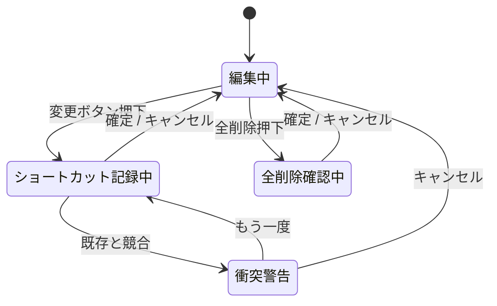

# clip-shelf - 設定ウィンドウ仕様（フロントエンド）

> **機能**: [clip-shelf](./index.md)
> **ステータス**: 下書き
> **対応モック**: `design/04-settings.html`

## 概要

`clip-shelf` の動作設定を編集するウィンドウ。macOS の標準設定パターンに従い、トラフィックライト3つを持つ通常ウィンドウとして表示する。

## サーフェス

| 項目 | 仕様 |
|:-----|:-----|
| 種別 | `NSWindow`（標準。`windowStyleMask` に `.titled`, `.closable`, `.miniaturizable`） |
| サイズ | 680×480 固定（リサイズ不可）|
| 個数 | シングル。再オープン時は同一インスタンスを前面に出す |
| 呼び出し | メニューバー → 「設定…」 / `Cmd + ,` |

## レイアウト

タブなしの単一スクロール。設定はカテゴリで縦に区切る。

```
┌─────────────────────────────────────────────────────────────┐
│ ● ● ●                       clip-shelf — 設定                │
├─────────────────────────────────────────────────────────────┤
│                                                             │
│  起動                                                        │
│  ┌─────────────────────────────────────────────────────┐   │
│  │ ログイン時に自動起動                            [⏺]   │   │
│  └─────────────────────────────────────────────────────┘   │
│                                                             │
│  クリップボード監視                                          │
│  ┌─────────────────────────────────────────────────────┐   │
│  │ 履歴の上限件数                       [ 500 ▾]        │   │
│  ├─────────────────────────────────────────────────────┤   │
│  │ パスワードフィールドを除外            [⏺]            │   │
│  ├─────────────────────────────────────────────────────┤   │
│  │ 画像を履歴に含める                    [⏺]            │   │
│  └─────────────────────────────────────────────────────┘   │
│                                                             │
│  ショートカット                                              │
│  ┌─────────────────────────────────────────────────────┐   │
│  │ ピッカーを開く            [⌘ ⇧ V]   [変更...]       │   │
│  ├─────────────────────────────────────────────────────┤   │
│  │ 履歴ブラウザを開く        [⌘ ⇧ H]   [変更...]       │   │
│  └─────────────────────────────────────────────────────┘   │
│                                                             │
│  外観                                                        │
│  ┌─────────────────────────────────────────────────────┐   │
│  │ テーマ        ( ) システム  ( ) ライト  ( ) ダーク   │   │
│  └─────────────────────────────────────────────────────┘   │
│                                                             │
│  データ                                                      │
│  ┌─────────────────────────────────────────────────────┐   │
│  │ [履歴を全削除...]                                    │   │
│  └─────────────────────────────────────────────────────┘   │
└─────────────────────────────────────────────────────────────┘
```

## コンポーネント

| コンポーネント | 種別 | 説明 |
|:-------------|:-----|:-----|
| `SettingsWindow` | `Scene` | ウィンドウ本体 |
| `SettingsSection` | カスタム `View` | カテゴリ見出し + カード |
| `ToggleRow` | `Toggle` | スイッチ式の真偽値設定 |
| `PickerRow` | `Picker` | 履歴上限件数のドロップダウン |
| `ShortcutRow` | カスタム `View` | 現在のショートカット表示 + 「変更…」ボタン |
| `ShortcutRecorder` | `KeyboardShortcuts.Recorder` ラッパー | キャプチャ式の入力 UI（`KeyboardShortcuts.Recorder` を直接埋め込み） |
| `ThemeRadioGroup` | カスタム `View` | システム / ライト / ダーク の3択ラジオ |
| `DangerButton` | `Button` | 「全削除…」のような破壊的操作。アクセント色は赤系 |

## 設定項目

| カテゴリ | 項目 | 型 | デフォルト | 永続化キー |
|:---------|:-----|:---|:----------|:----------|
| 起動 | ログイン時に自動起動 | `Bool` | `false` | `launchAtLogin` |
| クリップボード監視 | 履歴の上限件数 | `Int`（50/200/500/1000/無制限） | `500` | `historyLimit` |
| クリップボード監視 | パスワードフィールドを除外 | `Bool` | `true` | `respectConcealedType` |
| クリップボード監視 | 画像を履歴に含める | `Bool` | `true` | `includeImages` |
| ショートカット | ピッカーを開く | `KeyboardShortcuts.Shortcut` | `⌘⇧V` | `KeyboardShortcuts.Name.openPicker` |
| ショートカット | 履歴ブラウザを開く | `KeyboardShortcuts.Shortcut` | `⌘⇧H` | `KeyboardShortcuts.Name.openHistory` |
| 外観 | テーマ | `enum {system,light,dark}` | `.system` | `appearance` |

永続化先は `UserDefaults.standard`。SwiftUI の `@AppStorage` と直接連携でき、`SMAppService`（ログイン項目）など macOS 標準 API との相性が良いため。ショートカットは `KeyboardShortcuts` ライブラリが `UserDefaults` に自動保存する（アプリ側で個別に書き込まない）。

## ユーザー操作

| 操作 | 振る舞い |
|:-----|:---------|
| トグル切替 | 即時保存。`SettingsStore` が変更を発行し、対象機能が即座に反映 |
| 履歴上限件数を変更 | 即時保存。新しい上限を超える分は次回起動時にバックグラウンドで剪定 |
| ショートカット変更 | 「変更…」 → モーダルでキャプチャ → 衝突チェック → 確定でホットキー再登録 |
| テーマ変更 | 即時反映。`Color.windowBackgroundColor` ベースのため再起動不要 |
| 履歴を全削除 | 確認シート → 「ピン留めを残す」チェックボックス → 削除実行 |
| ウィンドウを閉じる | `Cmd + W` / 赤ボタン。閉じる時に未保存はない（即時保存方式のため） |

## 状態管理

| 状態名 | 型 | 初期値 | 更新トリガー |
|:-------|:---|:-------|:-----------|
| `settings` | `Settings`（構造体） | `SettingsStore.load()` | UI 操作 |
| `isRecordingShortcut` | `Bool` | `false` | 「変更…」ボタン押下 |
| `isShowingDeleteAllConfirm` | `Bool` | `false` | 「履歴を全削除…」押下 |



## バリデーション

| 項目 | ルール | エラー表示 |
|:-----|:------|:----------|
| ショートカット | 修飾キーを1つ以上含む（Shift/Cmd/Option/Control のいずれか） | 「修飾キーを含めてください」インライン警告 |
| ショートカット | 他のアプリ/OSの予約と衝突しない（既知のリストを参照） | 「他のショートカットと競合しています」+ 強制設定する選択肢 |
| 履歴上限 | 1〜100,000 | プルダウン UI なので不正値は構造的に発生しない |

## アクセシビリティ

| 観点 | 対応方針 |
|:-----|:---------|
| キーボード操作 | `Tab` で全項目に到達、`Space` でトグル切替 |
| VoiceOver | 各行に `accessibilityLabel` + 現在値 |
| ラジオグループ | `accessibilityElement(children: .combine)` でグループ化 |

## エラー表示

| エラーケース | 表示方法 |
|:------------|:---------|
| ログイン項目登録失敗 | トグルが OFF に戻り、上部にバナー「ログイン項目を登録できませんでした」 |
| ショートカット登録失敗 | キャプチャモーダルで赤バーで通知し、確定させない |
| 設定保存失敗 | 値を元に戻し、ウィンドウ下部にトースト |

## 関連仕様

- [persistence-spec.md](./persistence-spec.md) — `SettingsStore` の API
- [clipboard-monitor-spec.md](./clipboard-monitor-spec.md) — ショートカット登録の挙動（`KeyboardShortcuts`）
- [technical-spec.md](./technical-spec.md) — テーマ変更の反映方式
