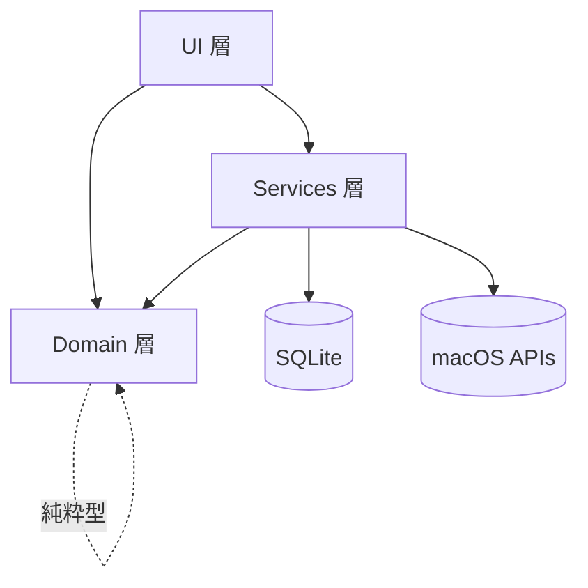
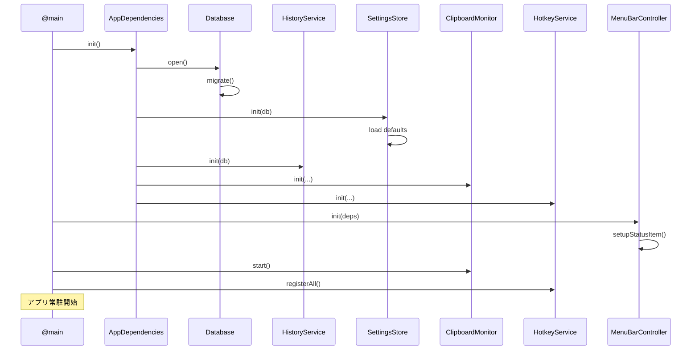

# clip-shelf - 技術仕様（横断）

> **機能**: [clip-shelf](./index.md)
> **ステータス**: 下書き

## 概要

clip-shelf 全体に関わる技術スタック・モジュール構成・依存方向・起動シーケンス・エラー方針などの横断的な仕様をまとめる。

## 技術スタック

| レイヤ | 採用技術 | 採用理由 |
|:------|:--------|:--------|
| 言語 | Swift 5.9+ | ネイティブで軽量、macOS API への直接アクセス |
| UI | SwiftUI（macOS 14+ ターゲット）| 宣言的 UI + ライト/ダーク自動対応 |
| AppKit ブリッジ | `NSStatusItem` / `NSPanel` / `NSWindow` | SwiftUI 単体では作れない常駐アイコンやフローティングパネルのため |
| DB | SQLite 3 | macOS 同梱、軽量、信頼性 |
| DB アクセス | GRDB.swift | スキーママイグレーション、`Combine` 連携、型安全 |
| グローバルショートカット | MASShortcut | OSS、設定UIから変更可能、安定実装 |
| ビルド | Xcode + xcodebuild | 標準 |
| 配布 | ローカルビルドのみ | 公開しないため |
| テスト | XCTest（最小限） | 主要サービスのユニットテスト |

## モジュール構成

```
clip-shelf/
├── Sources/
│   ├── App/
│   │   ├── ClipShelfApp.swift        # @main エントリーポイント
│   │   └── AppDependencies.swift     # DI コンテナ
│   ├── Domain/
│   │   ├── HistoryItem.swift
│   │   ├── HistoryFilter.swift
│   │   ├── Settings.swift
│   │   └── Errors.swift
│   ├── Services/
│   │   ├── ClipboardMonitor.swift
│   │   ├── HotkeyService.swift
│   │   ├── PasteService.swift
│   │   ├── HistoryService.swift
│   │   ├── SettingsStore.swift
│   │   └── Database.swift
│   ├── UI/
│   │   ├── MenuBar/
│   │   │   ├── MenuBarController.swift     # NSStatusItem ブリッジ
│   │   │   └── MenuBarDropdownView.swift
│   │   ├── PastePicker/
│   │   │   ├── PastePickerWindow.swift     # NSPanel ブリッジ
│   │   │   └── PastePickerView.swift
│   │   ├── History/
│   │   │   ├── HistoryWindow.swift
│   │   │   └── HistoryWindowView.swift
│   │   ├── Settings/
│   │   │   ├── SettingsWindow.swift
│   │   │   └── SettingsView.swift
│   │   └── Shared/
│   │       ├── HistoryItemContextMenu.swift
│   │       ├── HistoryRow.swift
│   │       └── ShortcutRecorder.swift
│   └── Resources/
│       ├── Assets.xcassets
│       └── Info.plist
└── Tests/
    └── ClipShelfTests/
```

## 依存方向



- `Domain` は他のどこにも依存しない純粋な型のみ
- `Services` は `Domain` と OS API、DB に依存する
- `UI` は `Services` と `Domain` に依存し、OS API に直接触れるのは `MenuBarController` などのブリッジ部のみ
- 逆方向の依存は禁止

## DI 構成

シンプルな手動 DI。`AppDependencies` がルートで全サービスを生成し、各 UI コンポーネントに注入する。

```swift
@MainActor
final class AppDependencies {
    let database: Database
    let settings: SettingsStore
    let history: HistoryService
    let monitor: ClipboardMonitor
    let hotkey: HotkeyService
    let paste: PasteService

    init() {
        self.database = Database.open()
        self.settings = SettingsStore(db: database)
        self.history  = HistoryService(db: database)
        self.paste    = PasteService(historyService: history)
        self.monitor  = ClipboardMonitor(historyService: history, settings: settings)
        self.hotkey   = HotkeyService(settings: settings)
    }
}
```

## 状態管理方針

- **データソース**: `HistoryService` と `SettingsStore` が唯一の信頼ソース
- **UI 状態**: SwiftUI の `@StateObject` / `@ObservedObject` を ViewModel 用に、`@State` をローカル UI 状態に
- **購読**: 各 ViewModel が `service.changes` を購読し `objectWillChange` を発火
- **ViewModel**: 画面ごとに1つ。`@MainActor` で動かす
- **Combine**: 主要な変更通知 (`HistoryService.changes`, `SettingsStore.changes`) は `AnyPublisher<Void, Never>`

## 起動シーケンス



## ライフサイクル管理

| イベント | 動作 |
|:--------|:-----|
| 起動 | DB 接続 → サービス初期化 → メニューバー登録 → ホットキー登録 → ポーリング開始 |
| アプリ非アクティブ化 | バックグラウンドでも動作継続（メニューバーアプリの特性） |
| Dock 非表示 | `Info.plist` の `LSUIElement = YES`（メニューバー専用アプリ） |
| ログイン項目 | `SMAppService.mainApp` で設定 ON/OFF |
| 終了 | ホットキー解放 → ポーリング停止 → DB pool フラッシュ |

## エラー方針

| レベル | 例 | 扱い |
|:------|:---|:-----|
| 致命的 | DB 破損、マイグレーション失敗 | アラート表示後にアプリ終了 or 「リセット」を促す |
| 機能不可 | Accessibility 権限不足 | UI バナーで通知、再取得を促す |
| 一時的 | ペースト失敗、書き戻し失敗 | 該当行に赤いインジケータ、ログのみ |
| 警告 | 上限超過、クリーンアップ | ログのみ、UI 表示なし |

### Result 型と throws の使い分け

| 用途 | 採用 |
|:-----|:-----|
| 同期 API でエラーが上位制御フローに必要 | `throws` |
| 非同期 API | `async throws` |
| 副作用なしの取得（失敗あり） | `Result<T, Error>` または optional |
| Combine ストリーム | `Failure == Never` を基本（エラーは Domain 側で吸収して `Event` に変換） |

## ログ

| 出力先 | 用途 |
|:------|:-----|
| `os_log`（macOS Unified Logging） | 開発時にコンソールで確認 |
| カテゴリ | `app.clipboard`, `app.paste`, `app.db`, `app.ui` |
| プライバシー | クリップボード内容は **絶対にログに含めない**。型・サイズ・ID のみ |

## テスト方針

個人プロジェクトなので網羅は目指さない。

| 対象 | 方針 |
|:-----|:-----|
| `HistoryService` | テーブル CRUD と重複判定をユニットテスト |
| `ClipboardMonitor` | `changeCount` 増加 → `add` 呼び出しの統合テスト（モック NSPasteboard 不可なので最小限） |
| `PasteService` | `CGEvent` 呼び出しは UT しにくいので手動確認のみ |
| マイグレーション | 各バージョンの up/down を XCTest で実行 |
| UI | スナップショットや自動テストはしない（手動目視） |

## ビルド構成

| 項目 | 設定 |
|:-----|:-----|
| Deployment Target | macOS 14.0 |
| アーキテクチャ | arm64（Apple Silicon のみ） |
| 最適化（Release）| `-O` |
| Swift モード | Strict Concurrency: complete |
| Sandbox | OFF（グローバルホットキー / Accessibility のため）|
| Hardened Runtime | OFF（ローカルビルドのみのため）|

## 配布

| 項目 | 方針 |
|:-----|:-----|
| 形式 | `.app` バンドル |
| 場所 | `/Applications` に手動コピー |
| Gatekeeper | 初回は右クリック → 開く で承認 |
| 署名 | しない（ローカル）。必要なら自己署名証明書 |
| 公証 | しない |
| 自動更新 | なし |

## 制限事項

- 全体としてシングルマシン・個人利用前提。マルチユーザー / マルチデバイスは未対応
- macOS のメジャーアップデートで API が壊れたら手動で直す（CI による互換性テストはなし）
- Strict Concurrency を有効にしているため、AppKit ブリッジ部分で `@MainActor` の取り扱いに注意

## 関連仕様

- すべてのドメイン仕様書
- [PRD](../prd-mac-clipboard-history.md)
