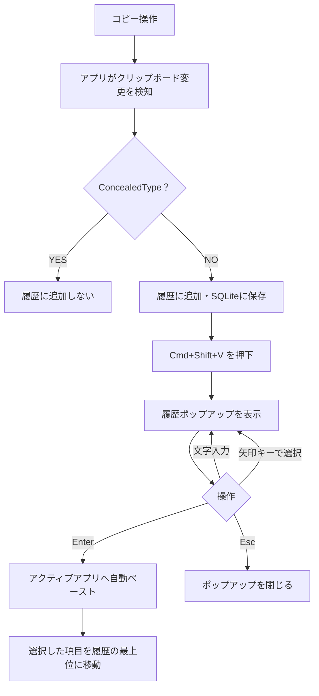

# Mac クリップボード履歴アプリ - プロダクト要件定義書（PRD）

> **バージョン**: 1.0
> **作成日**: 2026-05-12
> **作成者**: DIO0550
> **ステータス**: 下書き
> **想定読者**: 自分（個人利用ツール）

## 1. 課題

### 1.1 背景

普段 Mac で作業しているが、Windows の `Win + V`（クリップボード履歴）に慣れていて、Mac の「直近1件しか保持しない」クリップボードに不満がある。既存のサードパーティ製クリップボードアプリ（Paste、Maccy など）はあるが、

- 機能が多すぎて好みに合わない
- 課金が必要
- 自分の使い方に微妙にフィットしない

ため、**自分専用に最小限の機能だけを実装した Mac アプリ**を作る。

### 1.2 課題内容

- 1つ前にコピーした内容が、次のコピー操作で消える
- 複数の情報源（URL、コマンド、コード片、メールアドレスなど）を1つの文書に貼り付ける作業で、コピー元と貼り付け先を毎回往復する必要がある
- 一時退避先としてメモアプリに貼っておく、という回避策に頼っている

### 1.3 影響

- 日常作業のスピードが落ちる
- 「Mac 不便だな」という体験ストレスが地味に蓄積する

## 2. 目標と成功指標

### 2.1 目標

| 目標 | 説明 |
|:-----|:-----|
| 主目標 | Windows の `Win + V` と同等の体験を Mac で実現し、自分の日常コピペ作業を効率化する |
| 副目標 | 自分が満足する最小機能セットで、常駐していても気にならない軽量さに収める |

### 2.2 成功指標

公開しないため、自分の体感ベース＋実測の軽い指標のみ。

| 指標 | 目標 | 計測方法 |
|:-----|:-----|:---------|
| 1日で履歴ポップアップを呼び出す回数 | 自然に 5回以上呼び出している状態 | 自前のカウントログ（不要なら入れない） |
| 常駐メモリ使用量 | 50MB 以下 | Activity Monitor |
| アイドル時 CPU 使用率 | 1% 未満 | Activity Monitor |
| アプリのクラッシュ | 日常利用でほぼ発生しない | 体感 |

### 2.3 非目標

- **公開・配布**（App Store / GitHub Releases / 知人に配ることも含めて行わない）
- **ユーザーサポート・ドキュメント整備**（README すら最低限）
- **国際化**（日本語のみ）
- **クラウド同期 / 複数デバイス共有**
- **スニペット管理 / AI 連携 / テンプレ機能**
- **iOS / iPadOS 版**
- **App Store 申請・公証（Notarization）**（自分のマシンで動けばよい）
- **コード署名**（必要なら自分の開発者証明書でローカル署名するだけ）
- **他人の利用を想定した設定UI**（自分が困らなければ設定画面なしでも可）

## 3. 想定利用者

| 利用者 | 説明 | 使い方 |
|:-------|:-----|:------|
| 自分 | 普段使いの Mac ユーザー。元 Windows ユーザー | 開発・ブラウジング・文書作成の合間に頻繁にコピペする |

ペルソナは1人なので詳細なジャーニーは省略。

## 4. スコープ

### 4.1 対象範囲

| ID | 機能 | 優先度 | 説明 |
|:---|:-----|:-------|:-----|
| F-001 | クリップボード履歴の自動記録 | P0 | コピー操作のたびに履歴へ追加 |
| F-002 | グローバルショートカットで履歴UI呼び出し | P0 | デフォルト `Cmd + Shift + V` |
| F-003 | 履歴選択 → 自動ペースト | P0 | Enter またはダブルクリックで現在のアプリへペースト |
| F-004 | テキスト・画像・ファイルパスの履歴対応 | P0 | NSPasteboard の主要型 |
| F-005 | 履歴のローカル永続化 | P0 | アプリ・OS 再起動後も復元 |
| F-006 | メニューバー常駐 | P0 | アイコンクリックで履歴 |
| F-007 | 履歴のインクリメンタル検索 | P1 | 入力で絞り込み |
| F-008 | パスワード等の除外 | P1 | `ConcealedType` を尊重して保存しない |
| F-009 | 履歴の上限件数設定 | P1 | 設定ファイルに直書きでも可（自分しか触らない） |
| F-010 | ピン留め | P2 | あれば便利、なくても困らない |
| F-011 | 起動時自動起動（ログイン項目） | P2 | 設定 OS 機能でも代替可 |
| F-012 | ダーク/ライトモード追従 | P1 | macOS の外観設定に追従。SwiftUI のシステムカラー / マテリアルに乗せて自動切替 |
| F-013 | テーマ切替UI | P1 | 設定画面で「システムに従う / ライト固定 / ダーク固定」の3択を選べる。デフォルトは「システムに従う」 |

### 4.2 対象外

- 暗号化（**自分のマシン上だけ**なのでフルディスク暗号化に任せる。アプリ側では平文 SQLite で十分）
- ショートカットのカスタマイズUI（コードで固定でよい）
- アプリ単位の除外設定UI
- 国際化、アクセシビリティ対応の作り込み
- 自動アップデート機構

### 4.3 フェーズ分け

| フェーズ | 機能 | 備考 |
|:---------|:-----|:----|
| MVP | F-001 〜 F-006, F-012（外観追従） | これで日常使えるかをまず確認。ダーク/ライトは SwiftUI 標準カラーで初期から両対応 |
| 拡張 | F-007（検索）, F-008（除外）, F-009（上限）, F-013（テーマ切替UI） | 使っていて足りなければ追加 |
| 余裕があれば | F-010（ピン）, F-011（自動起動） | あれば便利、なければ放置 |

期限は設けない（趣味プロジェクト）。

## 5. 提案するソリューション

### 5.1 ソリューション概要

- **言語/UI**: Swift + SwiftUI
- **配布**: しない。`xcodebuild` でローカルビルドし、`/Applications` に手で置く
- **配布形式**: `.app` バンドル
- **公証**: しない。Gatekeeper を回避するため右クリック → 開く で初回起動するか、自分で署名する

### 5.2 主要ユーザーフロー

### 5.3 主要な設計判断

| 判断事項 | 検討した選択肢 | 選択 | 理由 |
|:---------|:-------------|:-----|:-----|
| 実装言語 | Swift / Electron / Rust + Tauri | Swift + SwiftUI | ネイティブで最も軽量、macOS API に直接アクセス、勉強も兼ねる |
| 履歴保存 | SQLite / Core Data / JSON | SQLite（GRDB.swift） | 履歴件数増加時の検索性能、自分の慣れ |
| 暗号化 | なし / アプリ内 / Keychain | **なし** | 自分のマシン外に出ないので不要。FileVault に任せる |
| ショートカット登録 | Carbon HotKey API / MASShortcut / NSEvent | MASShortcut | 実装が楽 |
| 自動ペースト方式 | クリップボード書き戻し + Cmd+V / Accessibility API 直接挿入 | クリップボード書き戻し + Cmd+V | 互換性が最も高い |
| 配布 | App Store / 公証DMG / 自前ビルド | 自前ビルド（自分の Mac のみ） | 公開しないので不要 |

## 6. 機能要件

| ID | 要件 | 優先度 | 受け入れ基準 |
|:---|:-----|:-------|:-----------|
| FR-001 | クリップボード変更検知 | P0 | コピー後 200ms 以内に履歴へ反映 |
| FR-002 | 履歴ポップアップ表示 | P0 | ショートカット押下から 100ms 以内に表示 |
| FR-003 | テキスト履歴 | P0 | プレーンテキスト / RTF を保持。ペースト時に元の型で復元 |
| FR-004 | 画像履歴 | P0 | PNG/JPEG/TIFF を保持、サムネイル表示 |
| FR-005 | ファイルパス履歴 | P0 | Finder からのコピー（NSURL）を保持 |
| FR-006 | 永続化 | P0 | アプリ・OS 再起動後も履歴を復元 |
| FR-007 | 選択ペースト | P0 | Enter / ダブルクリックでアクティブアプリにペーストし、ポップアップ自動クローズ |
| FR-008 | パスワード除外 | P1 | `org.nspasteboard.ConcealedType` のヒントを尊重 |
| FR-009 | 検索 | P1 | 入力文字でフィルタ |
| FR-010 | メニューバー常駐 | P0 | アイコンクリックで履歴 |
| FR-011 | テーマ切替 | P1 | 設定画面に「システム / ライト / ダーク」の3択。選択値は永続化し、起動直後から反映 |

## 7. 非機能要件

| カテゴリ | 要件 | 目標値 |
|:---------|:-----|:-------|
| パフォーマンス | ポップアップ表示遅延 | 100ms 以下（履歴 500件時） |
| パフォーマンス | アイドル時 CPU | 1% 未満 |
| パフォーマンス | 常駐メモリ | 50MB 以下 |
| 互換性 | 対応 OS | 自分が使っている macOS のバージョンのみ（現状 macOS 14 以降を想定） |
| 互換性 | アーキ | Apple Silicon のみで OK（Intel 対応不要） |
| 保守性 | コード規模 | 小さく保つ。1ファイル数百行程度で済むなら過剰な分割はしない |
| 外観 | ダーク/ライトモード | macOS のシステム外観に追従。SwiftUI の `Color.primary` / `Color.secondary` / マテリアル背景を使い、独自のハードコード色は避ける |
| 外観 | アクセントカラー | システムのアクセントカラーに従う。アプリ独自のブランドカラーは持たない |

国際化・アクセシビリティ・署名・公証は非要件。
デザインモック（`design/*.html`）はダーク基調で描かれているが、これは作業中の可視化用であり、実装ではライト/ダーク両対応とする。

## 8. 依存関係とリスク

### 8.1 依存関係

| 依存先 | 影響 |
|:-------|:-----|
| MASShortcut（OSS） | グローバルショートカット登録 |
| GRDB.swift（OSS） | SQLite ラッパー |
| Xcode | ローカルビルド |

Apple Developer Program 加入は不要（公開しないため）。

### 8.2 リスクと対策

| リスク | 発生確率 | 影響度 | 対策 |
|:-------|:---------|:-------|:-----|
| Gatekeeper でローカルビルドの `.app` が起動できない | 中 | 低 | 初回は右クリック → 開く、または `xattr -d com.apple.quarantine` で対処 |
| パスワードマネージャから機密情報を履歴化する | 中 | 中 | `ConcealedType` を実装初期から組み込む。1Password 等で動作確認 |
| 自動ペーストが一部アプリで効かない | 中 | 低 | クリップボードに残しておけば手動 `Cmd+V` で代替できる |
| macOS アップデートで API が壊れる | 低 | 中 | 自分が困ったタイミングで直す |

### 8.3 未解決の質問

| 質問 | 期限 |
|:-----|:-----|
| 履歴上限件数のデフォルト（200 / 500 / 1000 のどれか） | MVP 実装中に決める |
| 自動ペーストを既定 ON にするか、書き戻しまでに留めるか | MVP 実装中に決める |

## 9. ローンチ計画

公開しないので**該当なし**。
自分の `/Applications` に置いて、`launchd` か macOS のログイン項目で常駐させるだけ。

## 付録

### 用語集

| 用語 | 定義 |
|:-----|:-----|
| クリップボード履歴 | 過去にコピーした内容のリスト |
| グローバルショートカット | OS レベルで動作するキーボードショートカット |
| ConcealedType | macOS NSPasteboard の「機密扱い」型ヒント |

### 参考資料

- Apple Developer: [NSPasteboard ドキュメント](https://developer.apple.com/documentation/appkit/nspasteboard)
- nspasteboard.org（クリップボード共通仕様）

### 変更履歴

| バージョン | 日付 | 変更内容 |
|:-----------|:-----|:---------|
| 1.0 | 2026-05-12 | 初版作成（個人利用前提） |
